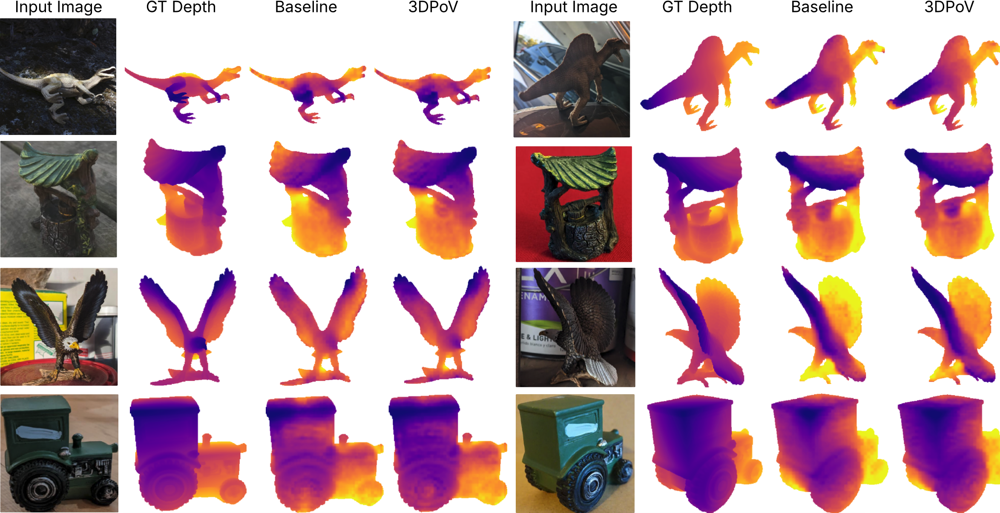

# 3DPoV: Improving 3D understanding via Patch Ordering on Video

[Ioana Simion](https://scholar.google.com/citations?view_op=list_works&hl=en&hl=en&user=Su8iPecAAAAJ), [Mohammadreza Salehi](https://scholar.google.com/citations?user=kpT3gcsAAAAJ&hl=en), [Yuki M. Asano](https://yukimasano.github.io/) [Shashanka Venkataramanan](https://scholar.google.co.in/citations?user=CbfH47IAAAAJ&hl=en), [Cees G. M. Snoek](https://www.ceessnoek.info/)


## Introduction

We propose **3DPoV**, a framework for learning temporally consistent dense features from videos by leveraging motion cues and patch-level correspondences. The method is built around a teacher-student architecture, where video frames are processed independently by the student, and the teacher provides a stable reference for supervision. To enforce temporal consistency, we track a grid of points across frames and extract features at aligned locations. Instead of matching features directly, we supervise the student by aligning the similarity rankings of tracked patches--computed with respect to a shared set of reference features-between each frame and the teacher-encoded anchor frame. This encourages the model to preserve relative similarity structure over time, even under large viewpoint or appearance changes.

<p align="center">
  
</p>


## Environment Setup
To ensure accurate results the environment for **3DPoV** is included. 

The setup steps are:

**1 – Create a new environment from the provided YAML file:**

```bash
conda env create -f environment.yml
```

**2 – Activate the environment:**

```bash
conda activate 3dpov
```


### Training Parameters Breakdown

The training script uses the following key parameters:


- `prefix_path \path`: Common path for the dataset/datasets used
- `model_type registers-b`: Pretrained backbone (dino, dino-b, dinov2, dinov2-b, registers, registers-b)
- `training_set mixed`: Training dataset name or 'mixed' for a mixture of datasets
- `mixed_datasets co3d ytvos dl3dv dl3dv_crop`: Dataset names to be included in mixture of datasets
- `batch_size 32`: Number of samples processed per GPU
- `frame_sampling_mode regular`: Uses regular interval sampling for video frames
- `regular_step 10`: Samples every 10th frame from the video
- `num_clip_frames 4`: Number of frames to process in each video clip
- `feature_upsampling off`: Off for latent tracking, nearest neighbor upsampling for resizing 
- `num_workers 24`: Number of data loading workers, adapt to number of CPU cores avaible per task
- `grid_size 16`: Size of the point grid in CoTrackerV3 module
- `crop_ratio 0.5`: Crop ratio for random cropping of references
- `use_EMA_teacher true`: Uses Exponential Moving Average for the teacher model
- `use_hardsoft true`: Leverage sorters of different steepness (harder and softer sorters)
- `hard_steepness 20`: Steepness value for the hard sorter
- `soft_steepness 3`: Steepness value for the soft sorter (and default if no hardsoft)
- `nmb_ref 5`: Number of references to select per video in batch
- `learning_rate 0.000001`: Starting learning rate of the modules, Feature extractor gets lr/10
- `checkpoint_name 3DPoV_model`: Suffix naming for checkpoint saving


The script is configured to use 4 GPUs by default. For single GPU training, modify the `CUDA_VISIBLE_DEVICES` and `--nproc_per_node` parameters accordingly.

## Evaluation

### Surface Normal estimation on NaVi

<p align="center">
  
</p>

Surface Normal Qualitative Examples. To highlight differences between models with shared architecture, we visualize the angular error between the Baseline and 3DPoV predictions, which highlights regions where surface normal estimates differ. Delta Error to GT denotes the difference in angular error between baseline and 3DPoV predictions with respect to the ground truth normals, shown only in regions of disagreement.Red areas indicate where 3DPoV predictions align more closely with the ground truth, while blue areas indicate where the baseline is closer. For baseline we use DinoV2 with Registers.


### Depth estimation on NaVi

<p align="center">
  
</p>

Depth Qualitative Examples. Comparing predicted depth maps from Baseline (DinoV2-reg) and 3DPoV. Ground truth (GT) depth is provided for referenceDepth Qualitative Examples. Comparing predicted depth maps from Baseline (DinoV2-reg) and 3DPoV. Ground truth (GT) depth is provided for reference